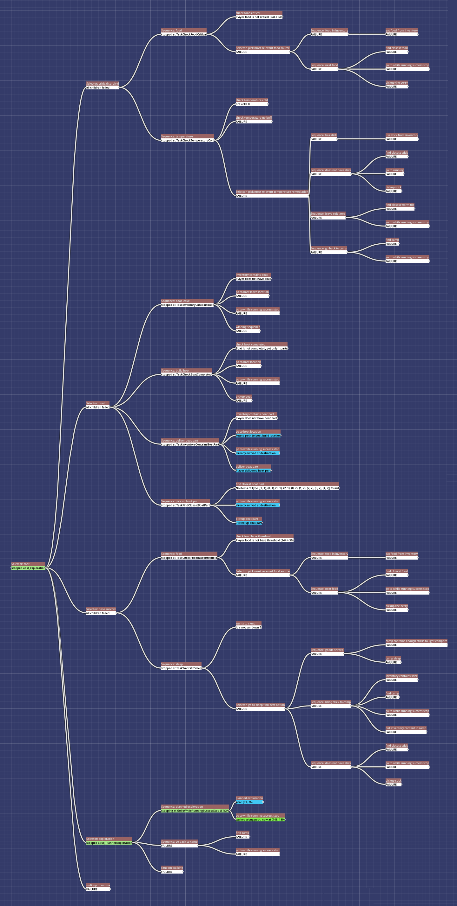

# Deserted Island Survivor: A Games and AI Visualization Project

Developed by
Colin Zenner (implementation assistance),
Dominik Koschik (tileset, map design and balancing),
Luca Ahlf (documentation, implementation assistance),
and Yan Wittmann (implementation, documentation and map design).
For detailed design and implementation insights, refer to the [project documentation](doc/CA2.pdf).

An autonomous survival simulation game developed in Godot,
featuring a behavior-tree-driven character that balances resource management and exploration with the goal of escaping
the island.

Our simulation expands on the "Food Gatherer" concept of Professor Eckert
by introducing more complex survival mechanics.

## Usage

Launch the [island.tscn](main-scenes/island.tscn) scene to start the game
and watch the AI prioritize tasks in real-time via the behavior tree visualization.

- Press 'T' to toggle the temperature layer - observe which regions of the island are too cold to traverse without a
  heat source.
- Press 'E' to toggle the visualization of the behaviour tree - To observe when which decision is made, when a decision
  gets aborted to serve a more critical need etc. You can resize this window.
- Press 'G' to Progress a single game tick - If the game isn't on auto mode, this helps to follow the characters journey
  step-by-step.
- Press 'F' to Fast forward - whether to speed up survival or hasten the inevitable... for better or worse.
- Press 'Space' to stop auto mode to pause the game or continue by using manual game ticks ('G').

Below, an example for the behavior tree as visualized in real-time in the simulation can be seen:

